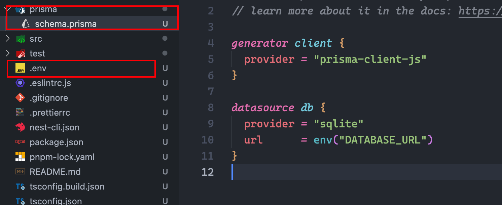
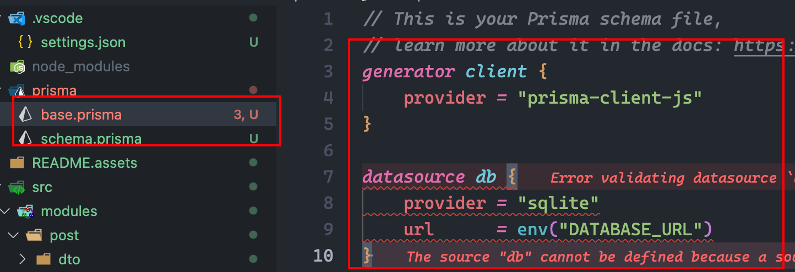
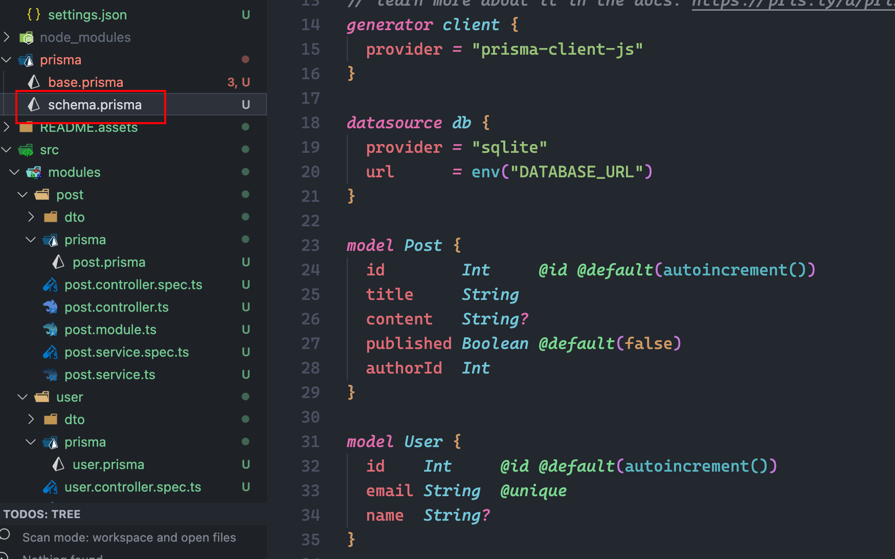
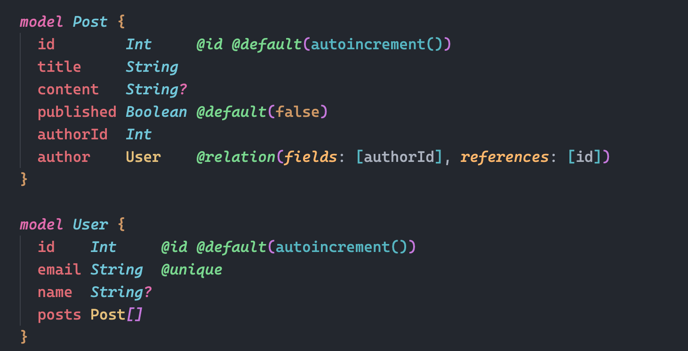
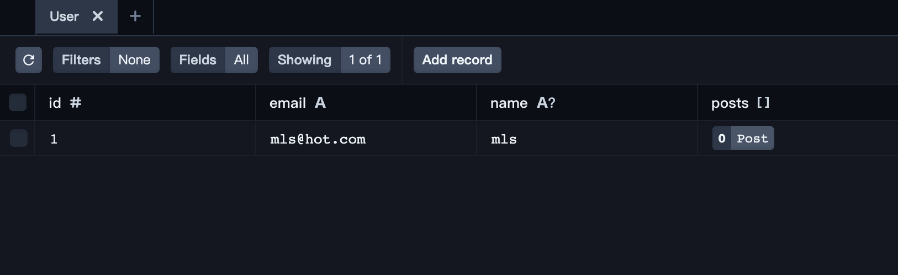

#	nestjs & prisma多schema文件开发

#### 支持prisma多文件模块开发，解决prisma单文件过大且难以维护，学习之前请看一下官方是否更新模块开发功能

[github](https://github.com/mxyhi/nest_prisma.git)

## 1. 新建项目

```sh
nest new nest_prisma
```

## 2.初始化prisma

- 安装prisma

```sh
pnpm add prisma
pnpm add @prisma/client
```

- 初始化项目(sqlite来做示例)

```sh
npx prisma init --datasource-provider sqlite
```

出现以下文件



## 3.创建prisma服务

```sh
nest generate module prisma
nest generate service prisma
```

在prisma.service.ts中封装服务

```ts
import { Injectable, OnModuleInit } from '@nestjs/common';
import { PrismaClient } from '@prisma/client';

@Injectable()
export class PrismaService extends PrismaClient implements OnModuleInit {
  async onModuleInit() {
    await this.$connect();
  }
}
```

在prisma.module.ts中导出

```js
import { Module } from '@nestjs/common';
import { PrismaService } from './prisma.service';

@Module({
  exports: [PrismaService],
  providers: [PrismaService],
})
export class PrismaModule {}
```

## 4.创建用户模块(rest api)

```sh
nest g res modules/user
```

- 删除 entities 文件夹 新建prisma文件夹及文件user.prisma

```prisma
model User {
    id    Int     @id @default(autoincrement())
    email String  @unique
    name  String?
}
```


## 5.创建文章模块(rest api)

```sh
nest g res modules/post
```

- 删除 entities 文件夹 新建prisma文件夹及文件post.prisma

```prisma
model Post {
  id        Int     @id @default(autoincrement())
  title     String
  content   String?
  published Boolean @default(false)
  authorId  Int
}
```

## 6.配置prisma模块开发

> 由于prisma官方不支持多schema文件模块开发，因此我们要手动配置

- 下载vscode插件[Prisma Import](https://marketplace.visualstudio.com/items?itemName=ajmnz.prisma-import)

- 停用/卸载Prisma官方插件（两个插件会冲突）

- 安装*prisma-merge* *prisma-import*

  ```sh
  pnpm add prisma-merge prisma-import -D
  ```

 - 配置prisma-import配置（文件位置可以动态调整，要跟脚本配置对应）

   ```json
   {
     "prisma": {
       "import": {
         "schemas": "./prisma/schema.prisma",
         "output": "./prisma/schema.prisma"
       }
     }
   }
   ```

 - 复制一份scheama.prisma文件改名为base.prisma放到指定位置（文件位置可以动态调整，要跟脚本配置对应）

   

 - 配置npm脚本（文件位置可以动态调整）

   ```json
   {
      "prisma-merge": "prisma-merge -b ./prisma/base.prisma -o ./prisma/schema.prisma",
       "prisma-import": "prisma-import -f",
       "prisma:merge": "npm run prisma-merge && npm run prisma-import",
   }
   ```

运行脚本

```sh
pnpm run prisma:merge
```

会发现内容已经合并到一个文件了



### 接下来我们把这两个表相互关联

user.prisma

```prisma
import { Post } from "../../post/prisma/post"

model User {
    id    Int     @id @default(autoincrement())
    email String  @unique
    name  String?
    posts Post[]
}
```

post.prisma

```prisma
import { User } from "../../user/prisma/user"

model Post {
    id        Int     @id @default(autoincrement())
    title     String
    content   String?
    published Boolean @default(false)
    authorId  Int
    author    User    @relation(fields: [authorId], references: [id])
}
```

在输入的时候会发现因为prisma import这个插件的作用下有提示功能，但是导入语法并不属于prisma官方功能所以我们要下载第三方包

- 运行 

  ```sh
  pnpm run prisma:merge
  ```

  

初始化prisma dev

```sh
npx prisma migrate dev --name init --schema=./prisma/schema.prisma
```

查看数据库表信息 prisma自带一个管理工具,通过以下脚本启动web在线界面

```sh
npx prisma studio
```


可以发现创建成功

## 7.使用prisma服务

- 在user.module中导入Prisma模块

  ```ts
  import { Module } from '@nestjs/common';
  import { UserService } from './user.service';
  import { UserController } from './user.controller';
  import { PrismaModule } from 'src/prisma/prisma.module';
  
  @Module({
    controllers: [UserController],
    providers: [UserService],
    imports: [PrismaModule],
  })
  export class UserModule {}
  ```

- 在user.service中导入Prisma服务使用

  ```ts
  import { Injectable } from '@nestjs/common';
  import { CreateUserDto } from './dto/create-user.dto';
  import { UpdateUserDto } from './dto/update-user.dto';
  import { PrismaService } from 'src/prisma/prisma.service';
  
  @Injectable()
  export class UserService {
    private readonly userModel: PrismaService['user'];
    constructor({ user: userModel }: PrismaService) {
      this.userModel = userModel;
    }
  }
  ```

### 新建用户接口

- create-user.dto （可以配置参数检验，这里做演示就不配了）

  ```ts
  import { User } from '@prisma/client';
  // import { IsNotEmpty, IsNumber, IsString, IsOptional } from 'class-validator';
  // import { Type } from 'class-transformer';
  
  export class CreateUserDto implements Omit<User, 'id'> {
    // @IsNotEmpty()
    // @IsString()
    email: string;
    // @IsNotEmpty()
    // @IsString()
    name: string;
  }
  ```

- user.service createAPI

  ```ts
  import { Injectable } from '@nestjs/common';
  import { CreateUserDto } from './dto/create-user.dto';
  import { UpdateUserDto } from './dto/update-user.dto';
  import { PrismaService } from 'src/prisma/prisma.service';
  
  @Injectable()
  export class UserService {
    private readonly userModel: PrismaService['user'];
    constructor({ user: userModel }: PrismaService) {
      this.userModel = userModel;
    }
    
    create(createUserDto: CreateUserDto) {
      return this.userModel.create({ data: createUserDto });
    }
  }
  ```

- Api 请求测试

  

数据库



已经成功

## 💡：会把这两个插件整合为npm包配置更简单

